# PROJECT-SPEC.md — EaseMail Redux v2 (ATOMIC BUILD PLAN)

**Last Updated**: February 15, 2026
**Version**: 2.0 (Atomic Rebuild)
**Build Methodology**: Context-Aware Phased Execution (200K token budget per phase)

---

## EXECUTIVE SUMMARY

This document replaces the original PROJECT-SPEC.md with an **atomic build plan** that decomposes every feature into its smallest working parts. The application architecture remains unchanged — this is a buildability rewrite, not an architectural redesign.

**Current State (Audit Completed Feb 15, 2026):**
- ✅ **7 core build stages COMPLETE** (Schema → Auth → CRUD → OAuth/Sync → Events → Automation → AI)
- ✅ **7 multi-account stages COMPLETE** (Multi-account support added Feb 2026)
- ✅ **Core email client FULLY FUNCTIONAL** (OAuth, sync, send, read, compose, search, AI)
- ⚠️ **1 blocking issue**: TypeScript type generation errors (fix: regenerate Supabase types)
- ⚠️ **30 missing features** identified (from 24 Tier 1-4 features in rebuild prompt)
- 📊 **Build completeness**: 85% core features, 15% polish/advanced features remaining

**What This Spec Delivers:**
1. **Gap Analysis**: Working vs. Broken vs. Missing features
2. **Atomic Decomposition**: Every feature broken into Database → Types → Utils → Providers → API → Hooks → UI → Wiring
3. **Shared Infrastructure Map**: Reusable components flagged with usage count and risk level
4. **Dependency Graph**: Visual and text-based dependency chains
5. **Phased Build Plan**: Context-budget-aware phases (100K-150K tokens each) with entry/exit criteria

---

## TABLE OF CONTENTS

1. [Project Identity](#project-identity)
2. [Tech Stack](#tech-stack)
3. [Codebase Inventory](#codebase-inventory) ← NEW
4. [Gap Analysis](#gap-analysis) ← NEW
5. [24 Missing Features (Tier 1-4)](#24-missing-features) ← NEW
6. [Atomic Feature Decomposition](#atomic-feature-decomposition) ← NEW
7. [Shared Infrastructure Map](#shared-infrastructure-map) ← NEW
8. [Dependency Graph](#dependency-graph) ← NEW
9. [Phased Build Plan](#phased-build-plan) ← NEW
10. [Data Model (Original)](#data-model-original)
11. [API Key Blueprint](#api-key-blueprint)

---

## PROJECT IDENTITY

**App name:** EaseMail
**Tagline:** AI-powered email for modern teams
**Owner:** BotMakers Inc. (subsidiary of BioQuest Inc.)
**Domain:** easemail.ai (placeholder — use NEXT_PUBLIC_APP_URL)

**User roles (4):**
1. `SUPER_ADMIN` — BotMakers staff. Full system access. Separate admin panel at /app/admin.
2. `ORG_OWNER` — Created or was transferred an org. Billing, member mgmt, org settings + full email client.
3. `ORG_MEMBER` — Invited to org. Full email client. Optional `is_admin: true` flag grants org admin permissions.
4. `INDIVIDUAL` — Retail customer. Full email client, personal billing. No org features.

**Email providers supported:**
- Microsoft (Outlook, Exchange, Microsoft 365) via Microsoft Graph API
- Google (Gmail, Google Workspace) via Gmail API
- Both use OAuth2 with PKCE. User connects accounts in settings or during onboarding.

---

## TECH STACK

- **Framework**: Next.js 14 (App Router, Server Components, Server Actions)
- **Database**: Supabase (Postgres + Auth + Realtime + Storage)
- **ORM**: Supabase client (no Prisma, no Drizzle)
- **UI**: shadcn/ui + Radix + Tailwind CSS
- **Rich text**: TipTap (composer)
- **Animation**: Framer Motion
- **State**: TanStack React Query + Zustand (client state)
- **Forms**: React Hook Form + Zod
- **Auth**: Supabase Auth (email/password + magic link)
- **Email sync**: Microsoft Graph API (Outlook/Exchange) + Gmail API (Google)
- **Calendar**: Microsoft Graph Calendar + Google Calendar API
- **Teams**: Microsoft Graph Teams API
- **AI**: OpenAI GPT-4o (remix, dictate, extract, categorize) + Whisper (transcription)
- **Billing**: Stripe (subscriptions, invoices, seat management)
- **Transactional email**: Resend + React Email
- **SMS**: Twilio
- **Hosting**: Vercel
- **File storage**: Supabase Storage (avatars, attachments)

**NO Redis. NO Nylas. NO PayPal. NO Prisma.**

**Design identity:**
- Primary: Blue #4A90D9
- Accent: Indigo #6366F1
- Success: Emerald #10B981
- Warning: Amber #F59E0B
- Error: Rose #F43F5E
- Background light: #F8FAFC
- Background dark: #0F172A
- Card: white with subtle shadow, rounded-xl (12px)
- Font: Plus Jakarta Sans (body), JetBrains Mono (monospace)
- Preferred UI: Ledger-style with coral #FF7F50 accents, mesh gradients, rounded cards
- Themes: Light + Dark (toggle in settings, system preference detection)

---

## CODEBASE INVENTORY

### Current File Count (as of Feb 15, 2026)
- **Total TypeScript files**: 150+
- **Database migrations**: 8 files (all applied)
- **Database tables**: 44 tables
- **API routes**: 12 routes
- **Server actions**: 12 files
- **Provider implementations**: 2 complete (Google, Microsoft)
- **Service libraries**: 7 (sync, automation, AI, events, search, auth, permissions)
- **React components**: 52 components
- **Page routes**: 22 pages
- **Type definitions**: 44 files
- **Validation schemas**: 9 files (Zod)

### Database Layer Status
**8 Migrations Applied** ✅
1. `001_initial_schema.sql` — 44 tables, 79 RLS policies, 94 indexes, 36 triggers
2. `002_auth_and_roles.sql` — Auth triggers, user auto-creation
3. `003_oauth_token_encryption.sql` — pgcrypto token encryption
4. `004_events.sql` — Event system (104 event types)
5. `005_automation_functions.sql` — Org seats, contact counts, full-text search
6. `006_encryption_key_parameter.sql` — Encryption key parameter passing
7. `007_fix_rls_recursion.sql` — RLS recursion fix (service role for super admin)
8. `008_add_account_to_notifications.sql` — Multi-account notification support

**All tables operational, no schema gaps.**

### API Layer Status
**12 Routes — All Functional** ✅
- Auth: Google OAuth, Microsoft OAuth
- Sync: Manual sync trigger
- Cron: Email sync (15 min), token refresh (30 min), scheduled emails (5 min), snoozed emails (5 min)
- AI: Remix, Dictate, Extract Event, Categorize
- Health: Health check

### Provider/Service Layer Status
**All Core Services Complete** ✅
- **Google Provider**: 1067 lines, 23 functions (OAuth, messages, folders, contacts, calendar)
- **Microsoft Provider**: ~1000 lines, 23 functions (complete Graph API integration)
- **Email Sync**: Initial sync + delta sync + folder sync (775 lines)
- **Token Manager**: Auto-refresh with race condition protection
- **Automation**: Rules engine (8 conditions, 11 actions), event handlers, usage limits
- **AI**: 4 features (remix, dictate, extract, categorize), rate limiting, usage tracking
- **Search**: Full-text search with weighted ranking, filters, pagination
- **Events**: Append-only log, 104 event types, timeline queries

### Frontend Layer Status
**22 Pages, 52 Components** ✅
- **App Pages** (18): inbox, sent, drafts, archive, trash, scheduled, templates, labels, contacts, activity, settings, folder/[id], admin/*
- **Auth Pages** (3): signin, signup, reset-password
- **Landing** (1): home page
- **UI Components**: 34 shadcn/ui + 18 custom components
- **Multi-account Support**: Account switcher, per-account filtering, account-aware composer

---

## GAP ANALYSIS

### ✅ WORKING (End-to-End Functional)

**Core Email Features** (12 working):
1. ✅ OAuth2 connection (Google + Microsoft with PKCE)
2. ✅ Multi-account support (switcher, per-account inbox filtering)
3. ✅ Initial email sync (folders, messages last 30 days, contacts top 100)
4. ✅ Delta sync (incremental updates every 15 min via webhook/polling)
5. ✅ Read messages (inbox, sent, drafts, archive, trash, custom folders)
6. ✅ Send email (via composer with account selector)
7. ✅ Compose draft (TipTap rich text editor, auto-save)
8. ✅ Message flags (read/unread, star, archive, trash, move to folder)
9. ✅ Custom labels (create, assign, filter by label)
10. ✅ Smart inbox (5 categories: priority, people, newsletters, notifications, promotions)
11. ✅ Full-text search (weighted: subject A, sender B, body C + filters)
12. ✅ Contact management (CRUD, auto-create from sent/received emails)

**Automation Features** (6 working):
13. ✅ Email rules engine (8 condition fields, 5 operators, 11 actions, priority ordering)
14. ✅ Usage limits (plan-based quotas: FREE, PRO, BUSINESS, ENTERPRISE)
15. ✅ Auto-categorization (AI batch categorization during sync)
16. ✅ Event system (104 event types, append-only log, timeline queries)
17. ✅ In-app notifications (bell icon, dropdown, real-time updates, mark read)
18. ✅ Keyboard shortcuts (global shortcuts, navigation chords, Cmd+K command palette, ? help)

**AI Features** (4 working):
19. ✅ AI Remix (rewrite email in 4 tones: professional, friendly, brief, detailed)
20. ✅ AI Dictate (Whisper transcription → GPT-4o polish → return polished text + subject)
21. ✅ AI Event Extract (extract calendar event details from email body)
22. ✅ AI Categorize (batch categorize up to 20 messages: people, newsletter, notification, promotion, social)

**Auth & Admin** (8 working):
23. ✅ Sign in (email/password + magic link)
24. ✅ Sign up (email verification)
25. ✅ Password reset
26. ✅ User roles (SUPER_ADMIN, ORG_OWNER, ORG_MEMBER, INDIVIDUAL)
27. ✅ Organization management (CRUD, invite members, accept invites, transfer ownership)
28. ✅ Admin panel (users, orgs, activity feed, audit logs, system settings)
29. ✅ Admin impersonation (start session, view as user, end session)
30. ✅ Audit logging (all user actions logged with IP, user agent, details)

**Total Working Features**: 30/54 planned (55% complete)

---

### ⚠️ BROKEN/INCOMPLETE (Code Exists But Doesn't Work)

**BLOCKING (Prevents Production Deploy):**
1. ❌ **TypeScript Build Errors** (Stage 4 files)
   - **Root Cause**: Supabase database types inferring `never` for some tables
   - **Affected Files**: settings/accounts/page.tsx, OAuth routes, cron routes
   - **Fix**: `npx supabase gen types typescript --project-id lrhzpvpuxlrpnolvqxis > src/types/database.ts`
   - **Impact**: Cannot deploy to production
   - **Status**: All Stage 7 AI code compiles without errors — this is a pre-existing issue from multi-account stages

**NON-BLOCKING (Fix Before Production):**
2. ⚠️ **Calendar Integration** — Event extraction works, but create/update API not implemented
   - **Missing**: `createCalendarEvent()` and `updateCalendarEvent()` in Google/Microsoft providers
   - **Existing**: Event extraction UI + API, calendar metadata sync
   - **Status**: Stubbed with TODO comments

3. ⚠️ **Email Forwarding** — Provider API complete, UI missing
   - **Missing**: Forward button in message view, forward mode in composer
   - **Existing**: `forwardMessage()` in providers, forward draft schema
   - **Status**: Backend complete, UI missing

4. ⚠️ **Scheduled Email Sending** — Cron job exists, send logic incomplete
   - **Missing**: `sendScheduledEmail()` implementation in providers
   - **Existing**: Scheduled email schema, cron job, queue
   - **Status**: Partially implemented

5. ⚠️ **Gatekeeper** — Unknown sender blocking works, approval flow incomplete
   - **Missing**: "Accept sender" action to create priority sender
   - **Existing**: Gatekeeper card UI, priority_senders table, blocking logic
   - **Status**: UI exists, action stubbed

6. ⚠️ **Signature Management** — CRUD working, composer integration incomplete
   - **Missing**: Signature selector in composer, auto-insertion
   - **Existing**: Signature CRUD server actions, signatures table
   - **Status**: Backend complete, UI integration missing

7. ⚠️ **Template Management** — CRUD working, composer integration incomplete
   - **Missing**: Template selector in composer, variable replacement
   - **Existing**: Template CRUD server actions, templates table
   - **Status**: Backend complete, UI integration missing

8. ⚠️ **Attachment Handling** — Schema exists, upload/download incomplete
   - **Missing**: Attachment upload UI, Supabase Storage integration, download logic
   - **Existing**: Attachment metadata in messages table, `getAttachment()` in providers
   - **Status**: Metadata stored, upload/download missing

9. ⚠️ **2FA** — Schema exists, implementation missing
   - **Missing**: TOTP generation, verification flow, backup codes, 2FA settings UI
   - **Existing**: two_factor_enabled, two_factor_secret, backup_codes table
   - **Status**: Schema only

10. ⚠️ **Billing/Stripe** — Schema exists, checkout/webhooks not implemented
    - **Missing**: Stripe checkout flow, webhook handler, subscription management UI
    - **Existing**: Subscriptions, invoices, payment_methods tables, Stripe IDs
    - **Status**: Schema only

11. ⚠️ **SMS** — Schema exists, Twilio integration missing
    - **Missing**: Twilio API integration, SMS send/receive, SMS UI
    - **Existing**: sms_messages table
    - **Status**: Schema only

12. ⚠️ **Webhooks** — CRUD working, delivery/retry logic incomplete
    - **Missing**: Webhook delivery queue, retry logic, webhook event emission
    - **Existing**: Webhook CRUD server actions, webhooks + webhook_deliveries tables
    - **Status**: Partially implemented

13. ⚠️ **API Keys** — CRUD working, auth middleware incomplete
    - **Missing**: API key authentication in middleware, scoped permissions
    - **Existing**: API key CRUD server actions, api_keys table with hashed keys
    - **Status**: Partially implemented

**Total Broken/Incomplete**: 13 features

---

### ❌ MISSING (Zero Code Written)

**From Original Spec + 24 New Features:**

1. ❌ **Persistent Sessions** (Tier 1) — Users stay logged in forever unless they sign out
2. ❌ **Real-time Email Sync** (Tier 1) — New emails appear within 3-5 seconds via webhooks + SSE
3. ❌ **Reply / Reply All** (Tier 2) — Respond to emails with proper threading
4. ❌ **Cc/Bcc Support** (Tier 2) — Carbon copy recipients when composing
5. ❌ **Email Signatures** (Tier 2) — Automatic signature insertion per account
6. ❌ **Drafts Auto-Save** (Tier 2) — Save work in progress while composing
7. ❌ **Undo Send** (Tier 3) — Recall within 5-30 seconds
8. ❌ **Snooze Emails** (Tier 3) — Postpone to reappear later (schema exists, UI missing)
9. ❌ **Print Emails** (Tier 3) — Formatted printing
10. ❌ **Block Sender** (Tier 3) — Prevent emails from specific addresses
11. ❌ **One-Click Unsubscribe** (Tier 3) — Detect and expose unsubscribe links
12. ❌ **Spam Filtering** (Tier 3) — Automatic spam detection
13. ❌ **Read Receipts** (Tier 3) — Track when emails are read
14. ❌ **Vacation Responder** (Tier 3) — Auto-reply when away
15. ❌ **Email Preview Pane** (Tier 3) — View email without opening
16. ❌ **Calendar Integration** (Tier 4) — Handle meeting invites (partial: extract exists, CRUD missing)
17. ❌ **Import/Export** (Tier 4) — Backup and restore emails
18. ❌ **Encryption** (Tier 4) — End-to-end encrypted emails
19. ❌ **Smart Compose** (Tier 4) — AI-powered writing suggestions
20. ❌ **Offline Mode** (Tier 4) — Work without internet, sync when reconnected

**Additional Missing from Original Spec:**
21. ❌ **Onboarding Flow** — Step-by-step setup wizard
22. ❌ **Email Threading** — Conversation view (provider_thread_id exists, grouping partial)
23. ❌ **Mobile Responsive Design** — Optimized for mobile (desktop-first currently)
24. ❌ **Realtime UI Updates** — Supabase Realtime subscriptions for live updates
25. ❌ **Email Tracking** — Read receipts, link tracking
26. ❌ **Contact Sync** — Auto-sync contacts from Google/Microsoft
27. ❌ **Contact Groups** — Group contacts, send to group
28. ❌ **Email Printing** — Print-friendly view
29. ❌ **Email Sharing** — Share email as link
30. ❌ **Dark Mode Toggle UI** — Theme switcher in settings (provider exists, UI toggle missing)

**Total Missing**: 30 features

---

## 24 MISSING FEATURES (TIER 1-4 FROM REBUILD PROMPT)

### Tier 1 — Foundation (Everything depends on these)

#### Feature 1: Persistent Sessions
**Status:** MISSING
**Current State:** Supabase Auth configured, but sessions expire after inactivity
**Depends on:** None (foundation)
**Blocks:** All features requiring long-lived sessions

**What needs to be built:**
- Configure Supabase Auth to never expire sessions unless explicit logout
- Add "Remember Me" checkbox to signin form
- Update middleware to refresh sessions on every request
- Add session extension logic (extend expiry on activity)

---

#### Feature 2: Automatic OAuth Token Refresh
**Status:** ✅ WORKING (already implemented in Stage 4)
**Current State:** Token manager auto-refreshes tokens 5 min before expiry
**Location:** `src/lib/providers/token-manager.ts`

**Verification:**
- ✅ `getValidToken()` checks expiry, auto-refreshes if needed
- ✅ `refreshAccessToken()` calls provider refresh logic
- ✅ Race condition protection via row locking
- ✅ Cron job refreshes all tokens every 30 min

**No work needed — already complete.**

---

#### Feature 3: Real-Time Email Sync
**Status:** PARTIAL (polling every 15 min, webhooks not implemented)
**Current State:** Delta sync via cron job
**Depends on:** Feature 2 (token refresh)
**Blocks:** Real-time inbox updates, instant new email notifications

**What needs to be built:**
1. **Webhook Registration** — Register push notifications with Google/Microsoft
2. **Webhook Receiver Endpoint** — `/api/webhooks/google` and `/api/webhooks/microsoft`
3. **SSE Stream** — Server-Sent Events endpoint for UI updates
4. **Fallback Polling** — Keep cron job as fallback
5. **UI Real-Time Updates** — Supabase Realtime subscription or SSE client

---

### Tier 2 — Core Email Functions

#### Feature 4: Reply / Reply All / Forward
**Status:** PARTIAL (forward backend exists, reply/reply-all missing)
**Current State:** Composer exists, forward API implemented
**Depends on:** Feature 2 (token refresh)
**Blocks:** Email threading, conversation context

**What needs to be built:**
1. **Reply Mode in Composer** — Pre-fill recipient, subject ("Re: ..."), quoted text
2. **Reply All Mode** — Include all original recipients in CC
3. **Reply API Routes** — `/api/emails/reply`, `/api/emails/reply-all`
4. **Provider Functions** — `replyToMessage()`, `replyAllToMessage()` (already exist in providers)
5. **Thread Header Construction** — `In-Reply-To`, `References` headers for threading
6. **UI Integration** — Reply/Reply All buttons in message view

---

#### Feature 5: Cc/Bcc Support
**Status:** PARTIAL (schema exists, UI incomplete)
**Current State:** `cc_recipients` and `bcc_recipients` columns exist in messages/drafts
**Depends on:** Feature 4 (reply/forward)
**Blocks:** Professional email workflows

**What needs to be built:**
1. **Composer UI** — CC/BCC input fields (toggleable)
2. **Recipient Validation** — Zod schema for CC/BCC arrays
3. **Provider Send Logic** — Pass CC/BCC to Google/Microsoft send APIs (already implemented)
4. **Draft Save** — Save CC/BCC in draft auto-save

---

#### Feature 6: Attachment Handling
**Status:** PARTIAL (schema exists, upload/download missing)
**Current State:** Attachment metadata stored, download API stubbed
**Depends on:** Feature 2 (token refresh)
**Blocks:** File sharing, image embedding

**What needs to be built:**
1. **Supabase Storage Setup** — Create `attachments` bucket
2. **Upload UI** — Drag-and-drop, file picker in composer
3. **Upload Logic** — Upload to Supabase Storage, store path in `attachments` column
4. **Download Logic** — `getAttachment()` provider function (exists) → stream to user
5. **Inline Images** — Embed `cid:` references as data URIs (already implemented)
6. **Attachment Preview** — Thumbnails for images, icons for files

---

#### Feature 7: Email Signatures
**Status:** PARTIAL (CRUD exists, composer integration missing)
**Current State:** Signature CRUD working, signatures table populated
**Depends on:** None
**Blocks:** Professional email branding

**What needs to be built:**
1. **Composer Integration** — Signature selector dropdown
2. **Auto-Insertion** — Insert default signature on compose
3. **Per-Account Signatures** — Filter signatures by email_account_id
4. **Signature Position** — Insert above quoted text in replies

---

#### Feature 8: Drafts Auto-Save
**Status:** ✅ WORKING (already implemented in composer)
**Current State:** Auto-save every 3 seconds in composer
**Location:** `src/components/email/composer.tsx`

**Verification:**
- ✅ `saveDraft()` function calls draft server action
- ✅ Debounced auto-save (3 sec delay)
- ✅ Draft ID tracked in component state

**No work needed — already complete.**

---

#### Feature 9: Full-Text Search
**Status:** ✅ WORKING (already implemented in Stage 6)
**Current State:** Full-text search with weighted ranking
**Location:** `src/lib/search/index.ts`

**Verification:**
- ✅ Postgres tsvector search on subject + sender + body
- ✅ Weighted ranking (subject A, sender B, body C)
- ✅ Filters (from, folder, attachments, unread, date range, label, account)
- ✅ Cursor pagination

**No work needed — already complete.**

---

### Tier 3 — Professional Features

#### Feature 10: Undo Send
**Status:** MISSING
**Depends on:** Feature 4 (send email)
**Blocks:** None

**What needs to be built:**
1. **Queued Send Table** — `queued_sends` table with send_at timestamp
2. **Send Delay** — Delay send by 5-30 seconds (user setting)
3. **Undo UI** — Toast with "Undo" button
4. **Cancel Send** — Delete from queue if undo clicked
5. **Cron Job** — Process queued sends every second

---

#### Feature 11: Snooze Emails
**Status:** PARTIAL (schema exists, UI missing)
**Current State:** `snoozed_emails` table exists, cron job restores snoozed emails
**Depends on:** None
**Blocks:** Inbox zero workflows

**What needs to be built:**
1. **Snooze UI** — Snooze button with preset times (later today, tomorrow, next week, custom)
2. **Snooze Action** — Server action to create snoozed_emails record
3. **UI Hide Logic** — Filter out snoozed messages from inbox
4. **Unsnooze Notification** — Notify user when email returns

---

#### Feature 12: Keyboard Shortcuts
**Status:** ✅ WORKING (already implemented in Stage 6)
**Current State:** Full keyboard shortcut system
**Location:** `src/components/keyboard/shortcuts-provider.tsx`

**Verification:**
- ✅ Global shortcuts (c, g+i, g+s, g+d, g+t, /, Cmd+K, ?)
- ✅ Navigation chords (g then i/s/d/t)
- ✅ Command palette (Cmd+K) with fuzzy search
- ✅ Shortcuts help modal (?)

**No work needed — already complete.**

---

#### Feature 13: Print Emails
**Status:** MISSING
**Depends on:** None
**Blocks:** None

**What needs to be built:**
1. **Print Stylesheet** — CSS for print media
2. **Print View** — `/app/print/[messageId]` page
3. **Print Button** — Add to message view
4. **Print Logic** — `window.print()` on print view

---

#### Feature 14: Block Sender
**Status:** PARTIAL (schema exists, UI missing)
**Current State:** `priority_senders` table with `is_blocked` flag
**Depends on:** None
**Blocks:** Spam prevention

**What needs to be built:**
1. **Block Button** — Add to message view dropdown
2. **Block Action** — Server action to create priority_sender with is_blocked=true
3. **Filter Logic** — Hide blocked sender emails from inbox
4. **Unblock UI** — Manage blocked senders in settings

---

#### Feature 15: One-Click Unsubscribe
**Status:** MISSING
**Depends on:** None
**Blocks:** Newsletter management

**What needs to be built:**
1. **Unsubscribe Link Detection** — Parse email body/headers for unsubscribe links
2. **Unsubscribe Button** — Show in message view if link detected
3. **Unsubscribe Action** — HTTP GET/POST to unsubscribe URL
4. **Confirmation Toast** — "Unsubscribed from [sender]"

---

#### Feature 16: Spam Filtering
**Status:** PARTIAL (schema exists, AI categorization partial)
**Current State:** `spam_reports` table, AI categorization flags promotions
**Depends on:** Feature 2 (token refresh)
**Blocks:** Inbox cleanliness

**What needs to be built:**
1. **Spam Detection AI** — GPT-4o spam classification
2. **Auto-Move to Spam** — Move detected spam to spam folder
3. **Report Spam UI** — "Report spam" button
4. **Spam Training** — User reports train AI model

---

#### Feature 17: Read Receipts
**Status:** MISSING
**Depends on:** Feature 4 (send email)
**Blocks:** Email tracking

**What needs to be built:**
1. **Tracking Pixel** — 1x1 transparent image hosted on app domain
2. **Pixel Insertion** — Insert in sent emails (user opt-in)
3. **Pixel Endpoint** — `/api/track/open/[messageId]`
4. **Read Tracking** — Log open time, IP, user agent
5. **Read Status UI** — Show "Read" badge in sent folder

---

#### Feature 18: Vacation Responder
**Status:** MISSING
**Depends on:** Feature 3 (real-time sync)
**Blocks:** Out-of-office workflows

**What needs to be built:**
1. **Vacation Settings** — Enable/disable, start date, end date, message
2. **Auto-Reply Logic** — Reply to incoming emails once per sender
3. **Provider Integration** — Set vacation responder via Google/Microsoft API (or app-side logic)
4. **Vacation Status** — Show "Vacation responder active" banner

---

#### Feature 19: Email Preview Pane
**Status:** MISSING
**Depends on:** None
**Blocks:** Fast email triage

**What needs to be built:**
1. **Split View Layout** — Message list + preview pane (horizontal or vertical)
2. **Preview Component** — Render email body, attachments, actions
3. **Keyboard Navigation** — j/k to move between messages
4. **Preview Settings** — Toggle preview pane on/off, position (right/bottom/off)

---

### Tier 4 — Advanced/Differentiation

#### Feature 20: Calendar Integration
**Status:** PARTIAL (extract exists, CRUD missing)
**Current State:** AI event extraction working, calendar metadata synced
**Depends on:** Feature 2 (token refresh)
**Blocks:** Meeting management

**What needs to be built:**
1. **Calendar Event CRUD** — `createEvent()`, `updateEvent()`, `deleteEvent()` in providers (stubbed)
2. **Calendar View UI** — `/app/calendar` page with month/week/day views
3. **Event Creation Form** — Pre-filled from AI extraction
4. **RSVP Logic** — Accept/decline/tentative meeting invites
5. **Calendar Sync** — Sync calendar events every 15 min

---

#### Feature 21: Import/Export
**Status:** MISSING
**Depends on:** None
**Blocks:** Data portability

**What needs to be built:**
1. **Export UI** — "Export emails" button in settings
2. **Export Logic** — Generate .eml files or .mbox archive
3. **Import UI** — "Import emails" button with file picker
4. **Import Logic** — Parse .eml/.mbox, create messages
5. **Progress Indicator** — Show import/export progress

---

#### Feature 22: Encryption
**Status:** MISSING
**Depends on:** None
**Blocks:** Secure communication

**What needs to be built:**
1. **PGP Key Generation** — Generate key pair per user
2. **Key Management UI** — Import/export public keys
3. **Encrypt on Send** — Encrypt email body with recipient's public key
4. **Decrypt on Read** — Decrypt with user's private key
5. **Encryption Indicator** — Show "Encrypted" badge

---

#### Feature 23: Smart Compose
**Status:** PARTIAL (AI remix exists, smart compose missing)
**Current State:** AI Remix provides rewrite suggestions
**Depends on:** Feature 19 (AI features)
**Blocks:** Fast email composition

**What needs to be built:**
1. **Context-Aware Suggestions** — GPT-4o suggests replies based on email content
2. **Smart Compose UI** — Inline suggestions in composer
3. **Tab to Accept** — Accept suggestion with Tab key
4. **Suggestion Types** — Reply, greeting, closing, full email

---

#### Feature 24: Offline Mode
**Status:** MISSING
**Depends on:** None
**Blocks:** Offline email access

**What needs to be built:**
1. **Service Worker** — Cache emails, UI assets
2. **IndexedDB Storage** — Store emails locally
3. **Offline Indicator** — Show "Offline" banner
4. **Queue Offline Actions** — Queue sends, marks, deletes
5. **Sync on Reconnect** — Upload queued actions when online

---

## ATOMIC FEATURE DECOMPOSITION

### Decomposition Template

Each feature is broken down into these layers (bottom-up build order):

1. **Database Changes** — Migrations, columns, RLS policies, functions
2. **Shared Types & Utilities** — TypeScript types, helper functions
3. **Provider/Service Functions** — External API calls, business logic
4. **API Routes** — Next.js route handlers
5. **React Hooks** — Client-side state management
6. **UI Components** — React components
7. **Wiring** — Integration points connecting layers
8. **Build Order** — Exact sequence of tasks within the feature

---

### Feature 1: Persistent Sessions

**Status:** MISSING
**Depends on:** None
**Blocks:** Features 3, 4, 6, 17, 18, 20

#### 1.1 Database Changes
| Change | Table | Details | Migration File |
|--------|-------|---------|----------------|
| ADD COLUMN | users | remember_me (boolean, default false) | 009_persistent_sessions.sql |
| ADD COLUMN | users | session_expires_at (timestamptz, nullable) | 009_persistent_sessions.sql |

#### 1.2 Shared Types & Utilities
| Item | File Path | Purpose |
|------|-----------|---------|
| Type: SignInOptions | src/types/auth.ts | Add rememberMe: boolean option |
| Util: extendSession() | src/lib/auth/session.ts | Extend session expiry on activity |

#### 1.3 Provider/Service Functions
*No external provider calls needed*

#### 1.4 API Routes
*No new routes needed — handled in middleware*

#### 1.5 React Hooks
*No hooks needed — server-side logic*

#### 1.6 UI Components
| Component | File Path | Props | Renders | Verify By |
|-----------|-----------|-------|---------|-----------|
| RememberMeCheckbox | src/components/auth/signin-form.tsx | N/A (internal) | "Remember me" checkbox | Visual: checkbox in signin form |

#### 1.7 Wiring (Integration Points)
| What connects to what | File Modified | Change Description |
|-----------------------|---------------|-------------------|
| Signin form → signIn action | src/components/auth/signin-form.tsx | Pass rememberMe option |
| signIn action → Supabase Auth | src/lib/auth/actions.ts | Set session expiry based on rememberMe |
| Middleware → extendSession | src/middleware.ts | Call extendSession on every request |

#### 1.8 Build Order
1. Create migration → verify column exists
2. Create extendSession() util → verify extends expiry
3. Update signin form → add checkbox
4. Update signIn action → accept rememberMe param, set expiry
5. Update middleware → call extendSession on protected routes
6. Test end-to-end: signin with rememberMe=true, wait 24h, verify still logged in

---

### Feature 3: Real-Time Email Sync

**Status:** PARTIAL
**Depends on:** Feature 2 (auto token refresh) ✅
**Blocks:** Features 11, 18, 19

#### 3.1 Database Changes
| Change | Table | Details | Migration File |
|--------|-------|---------|----------------|
| ADD COLUMN | email_accounts | webhook_subscription_id (text, nullable) | 010_realtime_sync.sql |
| ADD COLUMN | email_accounts | webhook_expiry (timestamptz, nullable) | 010_realtime_sync.sql |
| ADD TABLE | realtime_connections | id, user_id, connection_id, connected_at | 010_realtime_sync.sql |

#### 3.2 Shared Types & Utilities
| Item | File Path | Purpose |
|------|-----------|---------|
| Type: WebhookPayload | src/types/webhook.ts | Shape of Google/Microsoft webhook push |
| Util: verifyWebhookSignature() | src/lib/providers/webhook-verify.ts | Verify HMAC signature |

#### 3.3 Provider/Service Functions
| Function | File Path | External API Call | Purpose | Verify By |
|----------|-----------|-------------------|---------|-----------|
| createSubscription() | src/lib/providers/google.ts | POST /gmail/v1/users/me/watch | Register push notification | Call function, verify subscription created |
| renewSubscription() | src/lib/providers/google.ts | POST /gmail/v1/users/me/watch | Renew expiring subscription | Call function, verify expiry extended |
| deleteSubscription() | src/lib/providers/google.ts | POST /gmail/v1/users/me/stop | Cancel subscription | Call function, verify subscription deleted |
| createSubscription() | src/lib/providers/microsoft.ts | POST /subscriptions | Register Graph webhook | Call function, verify subscription created |

#### 3.4 API Routes
| Route | Method | Auth | Calls | Input | Output | Verify By |
|-------|--------|------|-------|-------|--------|-----------|
| /api/webhooks/google | POST | Webhook secret | performDeltaSync() | { emailAddress, historyId } | 200 OK | POST test payload, verify sync triggered |
| /api/webhooks/microsoft | POST | Webhook secret | performDeltaSync() | { subscriptionId, clientState } | 200 OK | POST test payload, verify sync triggered |
| /api/realtime/stream | GET | User auth | SSE stream | N/A | text/event-stream | Connect, verify events received |

#### 3.5 React Hooks
| Hook | File Path | State Managed | Returns | Verify By |
|------|-----------|---------------|---------|-----------|
| useRealtimeSync() | src/hooks/use-realtime-sync.ts | SSE connection status | { connected, lastSync } | Mount in test component, verify connection |

#### 3.6 UI Components
| Component | File Path | Props | Renders | Verify By |
|-----------|-----------|-------|---------|-----------|
| RealtimeIndicator | src/components/inbox/realtime-indicator.tsx | { connected } | Green dot + "Live" when connected | Visual: green dot in inbox header |

#### 3.7 Wiring (Integration Points)
| What connects to what | File Modified | Change Description |
|-----------------------|---------------|-------------------|
| Email account connect → createSubscription | src/lib/sync/email-sync.ts | Register webhook after initial sync |
| Webhook receiver → delta sync | src/app/api/webhooks/*/route.ts | Trigger sync on push notification |
| SSE stream → Supabase Realtime | src/app/api/realtime/stream/route.ts | Listen to messages table, emit events |
| Inbox component → useRealtimeSync | src/app/(app)/app/inbox/page.tsx | Display real-time indicator |

#### 3.8 Build Order
1. Create migration → verify webhook columns exist
2. Create WebhookPayload type → verify TypeScript compiles
3. Create verifyWebhookSignature() → verify HMAC validation works
4. Add createSubscription() to Google provider → verify API call succeeds
5. Add createSubscription() to Microsoft provider → verify API call succeeds
6. Create webhook receiver endpoints → verify with test payloads
7. Create SSE stream endpoint → verify events stream
8. Create useRealtimeSync() hook → verify connection state management
9. Create RealtimeIndicator component → verify renders
10. Wire email account connect → createSubscription → verify webhook registered
11. Wire inbox → useRealtimeSync → verify live updates
12. Test end-to-end: send test email, verify appears within 5 seconds

---

### Feature 4: Reply / Reply All / Forward

**Status:** PARTIAL (forward backend exists)
**Depends on:** Feature 2 (auto token refresh) ✅
**Blocks:** Features 5, 7, 10, 23

#### 4.1 Database Changes
*No new tables needed — existing schema supports reply/forward*

#### 4.2 Shared Types & Utilities
| Item | File Path | Purpose |
|------|-----------|---------|
| Type: ReplyPayload | src/types/email.ts | Shape of reply API request |
| Util: buildReplyHeaders() | src/lib/utils/email-headers.ts | Constructs In-Reply-To, References headers |
| Util: quoteEmailBody() | src/lib/utils/email-quote.ts | Formats quoted text with ">" prefix |

#### 4.3 Provider/Service Functions
| Function | File Path | External API Call | Purpose | Verify By |
|----------|-----------|-------------------|---------|-----------|
| replyToMessage() | src/lib/providers/google.ts | POST /gmail/v1/users/me/messages/send | Send reply via Gmail API | Send test reply, check sent folder |
| replyToMessage() | src/lib/providers/microsoft.ts | POST /me/messages/{id}/reply | Send reply via Graph API | Send test reply, check sent folder |

#### 4.4 API Routes
| Route | Method | Auth | Calls | Input | Output | Verify By |
|-------|--------|------|-------|-------|--------|-----------|
| /api/emails/reply | POST | Yes | provider.replyToMessage() | { messageId, body, cc?, bcc? } | { success, messageId } | curl POST with test data |
| /api/emails/reply-all | POST | Yes | provider.replyToMessage() | { messageId, body } | { success, messageId } | curl POST with test data |

#### 4.5 React Hooks
| Hook | File Path | State Managed | Returns | Verify By |
|------|-----------|---------------|---------|-----------|
| useReply() | src/hooks/use-reply.ts | reply draft state | { replyTo, send, cancel } | Unit test or manual trigger |

#### 4.6 UI Components
| Component | File Path | Props | Renders | Verify By |
|-----------|-----------|-------|---------|-----------|
| ReplyComposer | src/components/email/reply-composer.tsx | { originalEmail, mode: 'reply'\|'replyAll'\|'forward' } | Pre-filled composer with quoted text | Visual: open reply, see quoted email |

#### 4.7 Wiring (Integration Points)
| What connects to what | File Modified | Change Description |
|-----------------------|---------------|-------------------|
| Message view reply button → ReplyComposer | src/components/inbox/message-view.tsx | Add onClick handler that opens ReplyComposer with email data |
| ReplyComposer send → /api/emails/reply | src/components/email/reply-composer.tsx | POST reply payload on send |

#### 4.8 Build Order
1. Create buildReplyHeaders() util → verify RFC 2822 compliance
2. Create quoteEmailBody() util → verify formatting
3. Update Google provider replyToMessage() → verify API call
4. Update Microsoft provider replyToMessage() → verify API call
5. Create /api/emails/reply route → verify with curl
6. Create /api/emails/reply-all route → verify with curl
7. Create useReply() hook → verify state management
8. Create ReplyComposer component → verify renders
9. Wire message view → ReplyComposer → verify end-to-end
10. Test: send reply, verify threading preserved

---

### Feature 5: Cc/Bcc Support

**Status:** PARTIAL (schema exists)
**Depends on:** Feature 4 (reply/forward)
**Blocks:** None

#### 5.1 Database Changes
*No changes needed — cc_recipients, bcc_recipients columns exist*

#### 5.2 Shared Types & Utilities
| Item | File Path | Purpose |
|------|-----------|---------|
| Update: SendEmailPayload | src/types/email.ts | Add cc?: Recipient[], bcc?: Recipient[] |

#### 5.3 Provider/Service Functions
*Already implemented in providers — Google/Microsoft send APIs accept CC/BCC*

#### 5.4 API Routes
*No changes needed — /api/emails/send already accepts CC/BCC*

#### 5.5 React Hooks
*No new hooks needed*

#### 5.6 UI Components
| Component | File Path | Props | Renders | Verify By |
|-----------|-----------|-------|---------|-----------|
| CcBccInputs | src/components/email/composer.tsx | N/A (internal) | CC/BCC input fields (toggleable) | Visual: click "Cc" button, see input appear |

#### 5.7 Wiring (Integration Points)
| What connects to what | File Modified | Change Description |
|-----------------------|---------------|-------------------|
| Composer → CcBccInputs | src/components/email/composer.tsx | Add CC/BCC state, render inputs |
| Composer send → include CC/BCC | src/components/email/composer.tsx | Include cc/bcc in sendEmail payload |

#### 5.8 Build Order
1. Update SendEmailPayload type → verify TypeScript compiles
2. Add CC/BCC state to Composer → verify state management
3. Create CcBccInputs UI → verify toggle works
4. Wire send → include CC/BCC → verify sent emails have CC/BCC
5. Test: send email with CC/BCC, verify recipients receive

---

### Feature 6: Attachment Handling

**Status:** PARTIAL (schema exists)
**Depends on:** Feature 2 (token refresh)
**Blocks:** Features 21, 22

#### 6.1 Database Changes
*No changes needed — attachments column exists as JSONB*

#### 6.2 Shared Types & Utilities
| Item | File Path | Purpose |
|------|-----------|---------|
| Type: Attachment | src/types/attachment.ts | { id, name, size, type, url, content_id? } |
| Util: uploadAttachment() | src/lib/storage/attachments.ts | Upload to Supabase Storage |
| Util: downloadAttachment() | src/lib/storage/attachments.ts | Download from Supabase Storage |

#### 6.3 Provider/Service Functions
*getAttachment() already exists in providers — needs wiring*

#### 6.4 API Routes
| Route | Method | Auth | Calls | Input | Output | Verify By |
|-------|--------|------|-------|-------|--------|-----------|
| /api/attachments/upload | POST | Yes | uploadAttachment() | FormData (file) | { id, url } | Upload test file, verify stored |
| /api/attachments/download/[id] | GET | Yes | downloadAttachment() | N/A | File stream | Download test file, verify contents |

#### 6.5 React Hooks
| Hook | File Path | State Managed | Returns | Verify By |
|------|-----------|---------------|---------|-----------|
| useAttachments() | src/hooks/use-attachments.ts | attachment list | { attachments, upload, remove } | Upload file, verify state updates |

#### 6.6 UI Components
| Component | File Path | Props | Renders | Verify By |
|-----------|-----------|-------|---------|-----------|
| AttachmentUploader | src/components/email/attachment-uploader.tsx | { onUpload } | Drag-and-drop zone + file picker | Visual: drag file, see preview |
| AttachmentList | src/components/email/attachment-list.tsx | { attachments, onRemove } | List of attachments with remove buttons | Visual: see attachment previews |

#### 6.7 Wiring (Integration Points)
| What connects to what | File Modified | Change Description |
|-----------------------|---------------|-------------------|
| Composer → AttachmentUploader | src/components/email/composer.tsx | Add attachment upload UI |
| Composer send → include attachments | src/components/email/composer.tsx | Include attachment IDs in sendEmail payload |
| Message view → attachment download | src/components/inbox/message-view.tsx | Render attachment links |

#### 6.8 Build Order
1. Create Supabase Storage bucket "attachments" → verify bucket exists
2. Create Attachment type → verify TypeScript compiles
3. Create uploadAttachment() util → verify uploads to Storage
4. Create downloadAttachment() util → verify downloads from Storage
5. Create /api/attachments/upload route → verify with Postman
6. Create /api/attachments/download/[id] route → verify with curl
7. Create useAttachments() hook → verify state management
8. Create AttachmentUploader component → verify drag-and-drop works
9. Create AttachmentList component → verify renders
10. Wire composer → attachments → verify end-to-end
11. Test: send email with attachment, verify recipient receives

---

## SHARED INFRASTRUCTURE MAP

### Shared Components (Used by 2+ Features)

#### Token Manager
**Used by:** Features 2, 3, 4, 6, 7, 10, 11, 17, 18, 20
**Current status:** ✅ EXISTS (Stage 4)
**Location:** `src/lib/providers/token-manager.ts`
**Must support:** getValidToken(), refreshToken(), handleExpiration()
**Risk level:** 🔴 CRITICAL — if this breaks, 10 features break

---

#### Email Composer (Base)
**Used by:** Features 4, 5, 6, 7, 8, 10, 23
**Current status:** ✅ EXISTS (Stage 4 + multi-account)
**Location:** `src/components/email/composer.tsx`
**Must support:** Plain text, rich text, recipients (to/cc/bcc), attachments, signatures, draft save, account selector
**Risk level:** 🔴 CRITICAL — if this breaks, 7 features break

---

#### Message View Component
**Used by:** Features 4, 6, 11, 13, 14, 15, 17, 19
**Current status:** ⚠️ PARTIAL (no dedicated component, renders in inbox)
**Location:** `src/components/inbox/message-view.tsx` (needs creation)
**Must support:** Render email body, show attachments, reply/forward buttons, print button, block sender, unsubscribe, snooze
**Risk level:** 🟡 HIGH — if this doesn't exist, 8 features can't be built

---

#### Supabase Storage Manager
**Used by:** Features 6, 21, 22
**Current status:** ❌ MISSING
**Location:** `src/lib/storage/index.ts` (needs creation)
**Must support:** Upload file, download file, delete file, list files
**Risk level:** 🟡 HIGH — if this doesn't exist, 3 features can't be built

---

#### Provider Interface (Abstraction)
**Used by:** ALL email features
**Current status:** ✅ EXISTS (Stage 4)
**Location:** `src/lib/providers/index.ts`
**Must support:** getProvider(type) factory function
**Risk level:** 🔴 CRITICAL — if this breaks, entire app breaks

---

#### Webhook Verification Util
**Used by:** Features 3, 18 (realtime features)
**Current status:** ❌ MISSING
**Location:** `src/lib/providers/webhook-verify.ts` (needs creation)
**Must support:** verifyGoogleWebhook(), verifyMicrosoftWebhook()
**Risk level:** 🟡 HIGH — if this doesn't exist, realtime sync fails

---

#### Email Threading Logic
**Used by:** Features 4, 19 (reply, preview pane)
**Current status:** ⚠️ PARTIAL (provider_thread_id exists, grouping partial)
**Location:** `src/lib/utils/email-threading.ts` (needs creation)
**Must support:** Group messages by thread, build thread tree
**Risk level:** 🟢 MEDIUM — nice to have, not critical

---

#### AI Service Client
**Used by:** Features 16, 23 (spam filtering, smart compose)
**Current status:** ✅ EXISTS (Stage 7)
**Location:** `src/lib/ai/client.ts`
**Must support:** GPT-4o API calls, rate limiting, usage tracking
**Risk level:** 🟢 MEDIUM — only affects AI features

---

#### Cron Job Infrastructure
**Used by:** Features 3, 10, 11 (realtime sync, undo send, snooze)
**Current status:** ✅ EXISTS (Stage 4 + 6)
**Location:** `vercel.json` + `src/app/api/cron/*`
**Must support:** Register cron jobs, auth via CRON_SECRET
**Risk level:** 🟡 HIGH — if this breaks, scheduled tasks fail

---

#### Notification System
**Used by:** Features 3, 11, 18 (realtime, snooze, vacation)
**Current status:** ✅ EXISTS (Stage 6)
**Location:** `src/components/notifications/notification-bell.tsx`
**Must support:** Create notification, mark read, delete
**Risk level:** 🟢 MEDIUM — UX improvement, not critical

---

## DEPENDENCY GRAPH

### Mermaid Diagram

```mermaid
graph TD
    F1[Feature 1: Persistent Sessions] --> F3[Feature 3: Real-Time Sync]
    F2[Feature 2: Token Refresh ✅] --> F3
    F2 --> F4[Feature 4: Reply/Forward]
    F2 --> F6[Feature 6: Attachments]
    F2 --> F17[Feature 17: Read Receipts]
    F2 --> F18[Feature 18: Vacation Responder]
    F2 --> F20[Feature 20: Calendar Integration]

    F4 --> F5[Feature 5: Cc/Bcc]
    F4 --> F7[Feature 7: Signatures]
    F4 --> F10[Feature 10: Undo Send]
    F4 --> F23[Feature 23: Smart Compose]

    F6 --> F21[Feature 21: Import/Export]
    F6 --> F22[Feature 22: Encryption]

    F3 --> F11[Feature 11: Snooze]
    F3 --> F18
    F3 --> F19[Feature 19: Preview Pane]

    F8[Feature 8: Drafts Auto-Save ✅]
    F9[Feature 9: Full-Text Search ✅]
    F12[Feature 12: Keyboard Shortcuts ✅]

    F13[Feature 13: Print]
    F14[Feature 14: Block Sender]
    F15[Feature 15: Unsubscribe]
    F16[Feature 16: Spam Filtering]

    F24[Feature 24: Offline Mode]

    style F2 fill:#10B981
    style F8 fill:#10B981
    style F9 fill:#10B981
    style F12 fill:#10B981
```



### Critical Path (Longest Dependency Chain)

**Path 1 (7 steps):**
```
Feature 2 (Token Refresh ✅)
→ Feature 4 (Reply/Forward)
→ Feature 7 (Signatures)
→ Feature 10 (Undo Send)
→ Feature 23 (Smart Compose)
```

**Path 2 (5 steps):**
```
Feature 2 (Token Refresh ✅)
→ Feature 3 (Real-Time Sync)
→ Feature 18 (Vacation Responder)
```

**Path 3 (4 steps):**
```
Feature 2 (Token Refresh ✅)
→ Feature 6 (Attachments)
→ Feature 21 (Import/Export)
```

### Feature Clusters (Can Be Built in Parallel)

**Cluster A (Email Composition):**
- Feature 4 (Reply/Forward)
- Feature 5 (Cc/Bcc)
- Feature 7 (Signatures)
- Feature 10 (Undo Send)
- Feature 23 (Smart Compose)

**Cluster B (Real-Time):**
- Feature 1 (Persistent Sessions)
- Feature 3 (Real-Time Sync)
- Feature 11 (Snooze)
- Feature 18 (Vacation Responder)

**Cluster C (File Handling):**
- Feature 6 (Attachments)
- Feature 21 (Import/Export)
- Feature 22 (Encryption)

**Cluster D (Independent Features - No Dependencies):**
- Feature 13 (Print)
- Feature 14 (Block Sender)
- Feature 15 (Unsubscribe)
- Feature 16 (Spam Filtering)
- Feature 19 (Preview Pane)
- Feature 24 (Offline Mode)

---

## PHASED BUILD PLAN

### Phase Sizing Rules (CRITICAL)

**Context Budget:**
- Target: 100K-150K tokens per phase
- Hard ceiling: 150K tokens (leaves 50K buffer for Claude reasoning)
- Emergency stop: If approaching 120K, finish current task and stop

**File Sizing:**
- Small file (migration, type, util): ~500-1K tokens
- Medium file (component, provider function): ~2K-3K tokens
- Large file (complex API route, hook): ~3K-5K tokens
- Reading existing file: +50% token cost (includes context loading)

**Phase Rules:**
- Each phase is independently deployable and testable
- No phase depends on work from a later phase
- Shared infrastructure gets built in the earliest phase that needs it
- Build order within every phase: Database → Types → Utilities → Providers → API → Hooks → UI → Wiring
- Every phase starts with entry criteria and ends with exit criteria

---

### Phase 0: Fix Blocking Issue (URGENT)

**Estimated context**: 5K tokens
**Estimated files**: 1 file regenerated
**Features covered**: None (infrastructure fix)

#### Entry Criteria
- [x] Build fails with TypeScript errors
- [x] Supabase project accessible

#### Atomic Task List

**Database (1 task)**
| # | Task | File | Verify |
|---|------|------|--------|
| 1 | Regenerate Supabase types | src/types/database.ts | npx supabase gen types typescript --project-id lrhzpvpuxlrpnolvqxis > src/types/database.ts |

**TypeScript (1 task)**
| # | Task | File | Verify |
|---|------|------|--------|
| 2 | Fix type errors in affected files | src/app/(app)/app/settings/accounts/page.tsx, OAuth routes, cron routes | npx tsc --noEmit |

**Build (1 task)**
| # | Task | File | Verify |
|---|------|------|--------|
| 3 | Verify build succeeds | N/A | npm run build |

#### Exit Criteria
- [ ] `npx tsc --noEmit` shows 0 errors
- [ ] `npm run build` succeeds
- [ ] All existing pages load without errors
- [ ] OAuth flow still works (test Google + Microsoft)

#### Handoff Notes for Phase 1
- Type errors resolved
- Build passing
- Ready to add new features

---

### Phase 1: Foundation (Sessions + Message View)

**Estimated context**: 120K tokens
**Estimated files**: 15 new + 8 modified = 23 total
**Features covered**: Feature 1 (Persistent Sessions), Message View Component (infrastructure)

#### Entry Criteria
- [ ] Phase 0 Exit Criteria all passing
- [ ] Build succeeds with no type errors

#### Atomic Task List

**Database (2 tasks)**
| # | Task | File | Verify |
|---|------|------|--------|
| 4 | Create migration for persistent sessions | supabase/migrations/009_persistent_sessions.sql | Add remember_me, session_expires_at columns to users |
| 5 | Apply migration | N/A | Run migration, verify columns exist |

**Types & Utilities (3 tasks)**
| # | Task | File | Verify |
|---|------|------|--------|
| 6 | Add rememberMe to SignInOptions type | src/types/auth.ts | TypeScript compiles |
| 7 | Create extendSession() util | src/lib/auth/session.ts | Unit test: call function, verify expiry extended |
| 8 | Create formatEmailDate() util | src/lib/utils/date.ts | Unit test: verify "2 hours ago" formatting |

**UI Components (5 tasks)**
| # | Task | File | Verify |
|---|------|------|--------|
| 9 | Add "Remember me" checkbox to signin form | src/components/auth/signin-form.tsx | Visual: checkbox appears |
| 10 | Create MessageView component | src/components/inbox/message-view.tsx | Visual: renders email body, subject, sender |
| 11 | Create MessageHeader component | src/components/inbox/message-header.tsx | Visual: shows sender, date, subject |
| 12 | Create MessageBody component | src/components/inbox/message-body.tsx | Visual: renders sanitized HTML |
| 13 | Create MessageActions component | src/components/inbox/message-actions.tsx | Visual: reply/archive/trash buttons (stubbed) |

**Wiring (5 tasks)**
| # | Task | File | Verify |
|---|------|------|--------|
| 14 | Update signIn action to accept rememberMe | src/lib/auth/actions.ts | Call signIn with rememberMe=true, verify session expiry set |
| 15 | Update middleware to extend sessions | src/middleware.ts | Make protected request, verify expiry extended |
| 16 | Replace inbox message list → MessageView | src/app/(app)/app/inbox/page.tsx | Click message, see MessageView open |
| 17 | Add MessageView to sent page | src/app/(app)/app/sent/page.tsx | Click message, see MessageView |
| 18 | Add MessageView to folder page | src/app/(app)/app/folder/[folderId]/page.tsx | Click message, see MessageView |

#### Exit Criteria
- [ ] User can sign in with "Remember me" and session persists indefinitely
- [ ] Sessions extend on every request
- [ ] MessageView component renders correctly on inbox/sent/folder pages
- [ ] No console errors
- [ ] npx tsc --noEmit passes
- [ ] BUILD-STATE.md updated

#### Handoff Notes for Phase 2
- Persistent sessions working
- MessageView component ready for reply/forward buttons (Phase 2)
- extendSession() middleware handles all protected routes

---

### Phase 2: Reply/Forward + Cc/Bcc

**Estimated context**: 130K tokens
**Estimated files**: 18 new + 6 modified = 24 total
**Features covered**: Feature 4 (Reply/Forward), Feature 5 (Cc/Bcc)

#### Entry Criteria
- [ ] Phase 1 Exit Criteria all passing
- [ ] MessageView component exists

#### Atomic Task List

**Types & Utilities (4 tasks)**
| # | Task | File | Verify |
|---|------|------|--------|
| 19 | Create ReplyPayload type | src/types/email.ts | TypeScript compiles |
| 20 | Create buildReplyHeaders() util | src/lib/utils/email-headers.ts | Unit test: verify In-Reply-To, References headers |
| 21 | Create quoteEmailBody() util | src/lib/utils/email-quote.ts | Unit test: verify "> " prefix on quoted lines |
| 22 | Update SendEmailPayload to include cc/bcc | src/types/email.ts | TypeScript compiles |

**Provider Functions (2 tasks)**
| # | Task | File | Verify |
|---|------|------|--------|
| 23 | Verify replyToMessage() in Google provider | src/lib/providers/google.ts | Already exists, test call |
| 24 | Verify replyToMessage() in Microsoft provider | src/lib/providers/microsoft.ts | Already exists, test call |

**API Routes (2 tasks)**
| # | Task | File | Verify |
|---|------|------|--------|
| 25 | Create /api/emails/reply route | src/app/api/emails/reply/route.ts | curl POST, verify reply sent |
| 26 | Create /api/emails/reply-all route | src/app/api/emails/reply-all/route.ts | curl POST, verify all recipients included |

**Hooks (1 task)**
| # | Task | File | Verify |
|---|------|------|--------|
| 27 | Create useReply() hook | src/hooks/use-reply.ts | Mount in test component, verify state management |

**UI Components (6 tasks)**
| # | Task | File | Verify |
|---|------|------|--------|
| 28 | Create ReplyComposer component | src/components/email/reply-composer.tsx | Visual: opens with pre-filled recipient, quoted text |
| 29 | Add reply button to MessageActions | src/components/inbox/message-actions.tsx | Visual: click reply, ReplyComposer opens |
| 30 | Add reply-all button to MessageActions | src/components/inbox/message-actions.tsx | Visual: click reply-all, all recipients included |
| 31 | Add forward button to MessageActions | src/components/inbox/message-actions.tsx | Visual: click forward, composer opens with "Fwd:" subject |
| 32 | Add Cc/Bcc inputs to Composer | src/components/email/composer.tsx | Visual: click "Cc", input appears |
| 33 | Update Composer send logic to include cc/bcc | src/components/email/composer.tsx | Send email with Cc/Bcc, verify recipients receive |

**Wiring (3 tasks)**
| # | Task | File | Verify |
|---|------|------|--------|
| 34 | Wire MessageActions → ReplyComposer | src/components/inbox/message-view.tsx | Click reply button, ReplyComposer opens |
| 35 | Wire ReplyComposer → /api/emails/reply | src/components/email/reply-composer.tsx | Click send, verify API called |
| 36 | Wire Composer Cc/Bcc → sendEmail | src/components/email/composer.tsx | Send with Cc/Bcc, verify sent email has recipients |

#### Exit Criteria
- [ ] User can reply to emails (pre-fills recipient, quotes original)
- [ ] User can reply-all (includes all original recipients in Cc)
- [ ] User can forward emails (pre-fills subject with "Fwd:")
- [ ] User can add Cc/Bcc recipients in composer
- [ ] Threading headers (In-Reply-To, References) preserved
- [ ] npx tsc --noEmit passes
- [ ] BUILD-STATE.md updated

#### Handoff Notes for Phase 3
- Reply/forward/Cc/Bcc working
- ReplyComposer component ready for signature integration (Phase 3)
- Composer ready for attachment upload (Phase 4)

---

### Phase 3: Signatures + Real-Time Sync Infrastructure

**Estimated context**: 140K tokens
**Estimated files**: 22 new + 7 modified = 29 total
**Features covered**: Feature 7 (Signatures), Feature 3 (Real-Time Sync - partial)

#### Entry Criteria
- [ ] Phase 2 Exit Criteria all passing
- [ ] Composer component exists with Cc/Bcc support

#### Atomic Task List

**Database (2 tasks)**
| # | Task | File | Verify |
|---|------|------|--------|
| 37 | Create migration for realtime sync | supabase/migrations/010_realtime_sync.sql | Add webhook columns to email_accounts, realtime_connections table |
| 38 | Apply migration | N/A | Run migration, verify tables/columns exist |

**Types & Utilities (3 tasks)**
| # | Task | File | Verify |
|---|------|------|--------|
| 39 | Create WebhookPayload types | src/types/webhook.ts | TypeScript compiles |
| 40 | Create verifyGoogleWebhook() util | src/lib/providers/webhook-verify.ts | Unit test: verify HMAC signature validation |
| 41 | Create verifyMicrosoftWebhook() util | src/lib/providers/webhook-verify.ts | Unit test: verify client state validation |

**Provider Functions (4 tasks)**
| # | Task | File | Verify |
|---|------|------|--------|
| 42 | Add createSubscription() to Google provider | src/lib/providers/google.ts | Call function, verify subscription created |
| 43 | Add renewSubscription() to Google provider | src/lib/providers/google.ts | Call function, verify expiry extended |
| 44 | Add createSubscription() to Microsoft provider | src/lib/providers/microsoft.ts | Call function, verify subscription created |
| 45 | Add renewSubscription() to Microsoft provider | src/lib/providers/microsoft.ts | Call function, verify expiry extended |

**API Routes (3 tasks)**
| # | Task | File | Verify |
|---|------|------|--------|
| 46 | Create /api/webhooks/google route | src/app/api/webhooks/google/route.ts | POST test payload, verify 200 response |
| 47 | Create /api/webhooks/microsoft route | src/app/api/webhooks/microsoft/route.ts | POST test payload, verify 200 response |
| 48 | Create /api/realtime/stream route (SSE) | src/app/api/realtime/stream/route.ts | GET request, verify text/event-stream response |

**Hooks (2 tasks)**
| # | Task | File | Verify |
|---|------|------|--------|
| 49 | Create useRealtimeSync() hook | src/hooks/use-realtime-sync.ts | Mount in test component, verify connection |
| 50 | Create useSignature() hook | src/hooks/use-signature.ts | Mount in test component, verify signature list loaded |

**UI Components (9 tasks)**
| # | Task | File | Verify |
|---|------|------|--------|
| 51 | Create RealtimeIndicator component | src/components/inbox/realtime-indicator.tsx | Visual: green dot when connected |
| 52 | Create SignatureSelector component | src/components/email/signature-selector.tsx | Visual: dropdown with signature list |
| 53 | Add signature insertion to Composer | src/components/email/composer.tsx | Visual: signature auto-inserted at bottom |
| 54 | Add signature management page | src/app/(app)/app/settings/signatures/page.tsx | Visual: CRUD signatures |
| 55 | Create SignatureForm component | src/components/settings/signature-form.tsx | Visual: create/edit signature with TipTap |
| 56 | Add SignatureSelector to Composer | src/components/email/composer.tsx | Visual: dropdown to select signature |
| 57 | Add SignatureSelector to ReplyComposer | src/components/email/reply-composer.tsx | Visual: dropdown to select signature |
| 58 | Add RealtimeIndicator to inbox header | src/app/(app)/app/inbox/page.tsx | Visual: green dot in inbox header |
| 59 | Add RealtimeIndicator to sent/folders | src/app/(app)/app/sent/page.tsx, folder/[id]/page.tsx | Visual: green dot in all email views |

**Wiring (6 tasks)**
| # | Task | File | Verify |
|---|------|------|--------|
| 60 | Wire email account connect → createSubscription | src/lib/sync/email-sync.ts | Connect account, verify webhook registered |
| 61 | Wire webhook receiver → delta sync | src/app/api/webhooks/*/route.ts | POST webhook, verify sync triggered |
| 62 | Wire SSE stream → Supabase Realtime | src/app/api/realtime/stream/route.ts | Subscribe to messages table, verify events emitted |
| 63 | Wire inbox → useRealtimeSync | src/app/(app)/app/inbox/page.tsx | Open inbox, verify SSE connection |
| 64 | Wire Composer → useSignature | src/components/email/composer.tsx | Open composer, verify signature loaded |
| 65 | Wire Composer send → insert signature | src/components/email/composer.tsx | Send email, verify signature included |

#### Exit Criteria
- [ ] User can create/edit/delete signatures in settings
- [ ] User can select signature in composer
- [ ] Signatures auto-insert in compose/reply
- [ ] Webhook subscriptions registered on account connect
- [ ] Webhook receivers respond to Google/Microsoft push notifications
- [ ] SSE stream emits events on new messages
- [ ] Realtime indicator shows connection status
- [ ] npx tsc --noEmit passes
- [ ] BUILD-STATE.md updated

#### Handoff Notes for Phase 4
- Signatures working in composer + reply
- Webhook infrastructure ready (registered but not fully tested end-to-end)
- SSE stream ready for UI consumption
- Next phase: Attachments + real-time UI updates

---

### Phase 4: Attachments + Real-Time UI Updates

**Estimated context**: 145K tokens
**Estimated files**: 20 new + 8 modified = 28 total
**Features covered**: Feature 6 (Attachments), Feature 3 (Real-Time Sync - complete)

#### Entry Criteria
- [ ] Phase 3 Exit Criteria all passing
- [ ] Webhook infrastructure exists
- [ ] SSE stream endpoint exists

#### Atomic Task List

**Database (1 task)**
| # | Task | File | Verify |
|---|------|------|--------|
| 66 | Create Supabase Storage bucket "attachments" | Supabase dashboard | Verify bucket exists with public access |

**Types & Utilities (3 tasks)**
| # | Task | File | Verify |
|---|------|------|--------|
| 67 | Create Attachment type | src/types/attachment.ts | TypeScript compiles |
| 68 | Create uploadAttachment() util | src/lib/storage/attachments.ts | Upload test file, verify stored |
| 69 | Create downloadAttachment() util | src/lib/storage/attachments.ts | Download test file, verify contents |

**API Routes (2 tasks)**
| # | Task | File | Verify |
|---|------|------|--------|
| 70 | Create /api/attachments/upload route | src/app/api/attachments/upload/route.ts | POST file, verify uploaded |
| 71 | Create /api/attachments/download/[id] route | src/app/api/attachments/download/[id]/route.ts | GET request, verify file stream |

**Hooks (1 task)**
| # | Task | File | Verify |
|---|------|------|--------|
| 72 | Create useAttachments() hook | src/hooks/use-attachments.ts | Upload file, verify state updates |

**UI Components (8 tasks)**
| # | Task | File | Verify |
|---|------|------|--------|
| 73 | Create AttachmentUploader component | src/components/email/attachment-uploader.tsx | Visual: drag-and-drop zone |
| 74 | Create AttachmentList component | src/components/email/attachment-list.tsx | Visual: list with previews |
| 75 | Add AttachmentUploader to Composer | src/components/email/composer.tsx | Visual: upload area in composer |
| 76 | Add AttachmentList to Composer | src/components/email/composer.tsx | Visual: uploaded files shown |
| 77 | Add attachment download to MessageBody | src/components/inbox/message-body.tsx | Visual: download links for attachments |
| 78 | Wire real-time updates to inbox | src/app/(app)/app/inbox/page.tsx | SSE event → new message appears |
| 79 | Wire real-time updates to sent | src/app/(app)/app/sent/page.tsx | SSE event → new sent message appears |
| 80 | Wire real-time updates to folders | src/app/(app)/app/folder/[folderId]/page.tsx | SSE event → folder updates |

**Wiring (5 tasks)**
| # | Task | File | Verify |
|---|------|------|--------|
| 81 | Wire Composer → useAttachments | src/components/email/composer.tsx | Upload file, verify state tracked |
| 82 | Wire Composer send → upload attachments | src/components/email/composer.tsx | Send with attachment, verify uploaded |
| 83 | Wire MessageBody → download attachments | src/components/inbox/message-body.tsx | Click download, verify file downloaded |
| 84 | Wire inbox → SSE stream | src/app/(app)/app/inbox/page.tsx | Send test email, verify appears within 5 sec |
| 85 | Wire folders → SSE stream | src/app/(app)/app/folder/[folderId]/page.tsx | Send test email, verify appears within 5 sec |

#### Exit Criteria
- [ ] User can upload attachments in composer (drag-and-drop + file picker)
- [ ] User can download attachments from messages
- [ ] Attachments stored in Supabase Storage
- [ ] Attachment previews show thumbnails for images
- [ ] Real-time inbox updates: new messages appear within 5 seconds
- [ ] Real-time updates work in inbox, sent, and folders
- [ ] Realtime indicator shows "Live" when connected
- [ ] npx tsc --noEmit passes
- [ ] BUILD-STATE.md updated

#### Handoff Notes for Phase 5
- Attachments fully working (upload, download, preview)
- Real-time sync complete (webhooks + SSE + UI updates)
- Composer feature-complete (compose, reply, forward, cc/bcc, signatures, attachments)
- Next phase: Advanced features (undo send, snooze, preview pane)

---

### Phase 5: Undo Send + Snooze + Preview Pane

**Estimated context**: 135K tokens
**Estimated files**: 18 new + 9 modified = 27 total
**Features covered**: Feature 10 (Undo Send), Feature 11 (Snooze), Feature 19 (Preview Pane)

#### Entry Criteria
- [ ] Phase 4 Exit Criteria all passing
- [ ] Composer fully functional

#### Atomic Task List

**Database (2 tasks)**
| # | Task | File | Verify |
|---|------|------|--------|
| 86 | Create migration for undo send | supabase/migrations/011_undo_send.sql | Add queued_sends table |
| 87 | Apply migration | N/A | Run migration, verify table exists |

**Types & Utilities (2 tasks)**
| # | Task | File | Verify |
|---|------|------|--------|
| 88 | Create QueuedSend type | src/types/email.ts | TypeScript compiles |
| 89 | Create snoozeTimePresets() util | src/lib/utils/snooze.ts | Unit test: verify presets (later today, tomorrow, next week) |

**API Routes (3 tasks)**
| # | Task | File | Verify |
|---|------|------|--------|
| 90 | Create /api/emails/queue route | src/app/api/emails/queue/route.ts | POST email, verify queued |
| 91 | Create /api/emails/cancel-send route | src/app/api/emails/cancel-send/route.ts | POST cancel, verify removed from queue |
| 92 | Create /api/cron/process-queued-sends route | src/app/api/cron/process-queued-sends/route.ts | Cron triggers, verify emails sent |

**Hooks (2 tasks)**
| # | Task | File | Verify |
|---|------|------|--------|
| 93 | Create useUndoSend() hook | src/hooks/use-undo-send.ts | Queue send, undo, verify canceled |
| 94 | Create useSnooze() hook | src/hooks/use-snooze.ts | Snooze message, verify hidden from inbox |

**UI Components (9 tasks)**
| # | Task | File | Verify |
|---|------|------|--------|
| 95 | Create UndoSendToast component | src/components/email/undo-send-toast.tsx | Visual: toast with "Undo" button |
| 96 | Create SnoozeDialog component | src/components/inbox/snooze-dialog.tsx | Visual: dialog with preset times |
| 97 | Create PreviewPane component | src/components/inbox/preview-pane.tsx | Visual: split view with message preview |
| 98 | Add undo send to Composer | src/components/email/composer.tsx | Send email, see undo toast for 5 sec |
| 99 | Add snooze button to MessageActions | src/components/inbox/message-actions.tsx | Visual: snooze button in actions |
| 100 | Add preview pane toggle to settings | src/app/(app)/app/settings/page.tsx | Visual: "Show preview pane" checkbox |
| 101 | Add preview pane to inbox | src/app/(app)/app/inbox/page.tsx | Visual: split view with preview |
| 102 | Add preview pane to sent | src/app/(app)/app/sent/page.tsx | Visual: split view with preview |
| 103 | Add preview pane to folders | src/app/(app)/app/folder/[folderId]/page.tsx | Visual: split view with preview |

**Wiring (7 tasks)**
| # | Task | File | Verify |
|---|------|------|--------|
| 104 | Wire Composer send → queue send | src/components/email/composer.tsx | Send email, verify queued for 5 sec |
| 105 | Wire UndoSendToast → cancel send | src/components/email/undo-send-toast.tsx | Click undo, verify send canceled |
| 106 | Wire snooze button → SnoozeDialog | src/components/inbox/message-actions.tsx | Click snooze, dialog opens |
| 107 | Wire SnoozeDialog → snooze action | src/components/inbox/snooze-dialog.tsx | Select time, verify message hidden |
| 108 | Wire preview pane toggle → user_preferences | src/app/(app)/app/settings/page.tsx | Toggle on, verify saved |
| 109 | Wire inbox → PreviewPane | src/app/(app)/app/inbox/page.tsx | Click message, preview appears |
| 110 | Update vercel.json with process-queued-sends cron | vercel.json | Add cron job (every 1 second) |

#### Exit Criteria
- [ ] User can send email with 5-second undo window
- [ ] User can undo send before delay expires
- [ ] User can snooze emails (later today, tomorrow, next week, custom)
- [ ] Snoozed emails hidden from inbox until snooze time
- [ ] User can enable preview pane in settings
- [ ] Preview pane shows in inbox, sent, folders
- [ ] Keyboard navigation (j/k) works with preview pane
- [ ] npx tsc --noEmit passes
- [ ] BUILD-STATE.md updated

#### Handoff Notes for Phase 6
- Undo send working (5-second delay, cancel queue)
- Snooze working (hide until time, unsnooze cron job already exists from Stage 6)
- Preview pane working (split view, keyboard nav)
- Next phase: Calendar integration + advanced features

---

### Phase 6: Calendar + Print + Block + Unsubscribe

**Estimated context**: 130K tokens
**Estimated files**: 16 new + 7 modified = 23 total
**Features covered**: Feature 20 (Calendar), Feature 13 (Print), Feature 14 (Block Sender), Feature 15 (Unsubscribe)

#### Entry Criteria
- [ ] Phase 5 Exit Criteria all passing
- [ ] AI event extraction working (already exists from Stage 7)

#### Atomic Task List

**Provider Functions (4 tasks)**
| # | Task | File | Verify |
|---|------|------|--------|
| 111 | Implement createEvent() in Google provider | src/lib/providers/google.ts | Call function, verify event created in Google Calendar |
| 112 | Implement updateEvent() in Google provider | src/lib/providers/google.ts | Call function, verify event updated |
| 113 | Implement createEvent() in Microsoft provider | src/lib/providers/microsoft.ts | Call function, verify event created in Outlook Calendar |
| 114 | Implement updateEvent() in Microsoft provider | src/lib/providers/microsoft.ts | Call function, verify event updated |

**API Routes (3 tasks)**
| # | Task | File | Verify |
|---|------|------|--------|
| 115 | Create /api/calendar/create route | src/app/api/calendar/create/route.ts | POST event, verify created |
| 116 | Create /api/calendar/update route | src/app/api/calendar/update/route.ts | POST update, verify updated |
| 117 | Create /api/senders/block route | src/app/api/senders/block/route.ts | POST block, verify sender blocked |

**Hooks (2 tasks)**
| # | Task | File | Verify |
|---|------|------|--------|
| 118 | Create useCalendar() hook | src/hooks/use-calendar.ts | Create event, verify state updates |
| 119 | Create useBlockSender() hook | src/hooks/use-block-sender.ts | Block sender, verify state updates |

**UI Components (10 tasks)**
| # | Task | File | Verify |
|---|------|------|--------|
| 120 | Create CalendarView page | src/app/(app)/app/calendar/page.tsx | Visual: month/week/day views |
| 121 | Create EventForm component | src/components/calendar/event-form.tsx | Visual: create/edit event form |
| 122 | Create EventList component | src/components/calendar/event-list.tsx | Visual: list of events |
| 123 | Wire AI extract → EventForm | src/components/ai/ai-extract-event-button.tsx | Extract event, pre-fill EventForm |
| 124 | Create PrintView page | src/app/(app)/app/print/[messageId]/page.tsx | Visual: print-friendly message view |
| 125 | Add print button to MessageActions | src/components/inbox/message-actions.tsx | Visual: print button |
| 126 | Add print stylesheet | src/app/globals.css | @media print: clean layout |
| 127 | Add block sender button to MessageActions | src/components/inbox/message-actions.tsx | Visual: block button in dropdown |
| 128 | Add unsubscribe detector | src/lib/utils/email-parse.ts | Parse email, detect List-Unsubscribe header |
| 129 | Add unsubscribe button to MessageBody | src/components/inbox/message-body.tsx | Visual: unsubscribe button if detected |

**Wiring (6 tasks)**
| # | Task | File | Verify |
|---|------|------|--------|
| 130 | Wire EventForm → createEvent | src/components/calendar/event-form.tsx | Submit form, verify event created |
| 131 | Wire CalendarView → useCalendar | src/app/(app)/app/calendar/page.tsx | Load page, verify events fetched |
| 132 | Wire print button → PrintView | src/components/inbox/message-actions.tsx | Click print, open PrintView in new tab |
| 133 | Wire block sender → /api/senders/block | src/components/inbox/message-actions.tsx | Click block, verify sender blocked |
| 134 | Wire unsubscribe button → HTTP request | src/components/inbox/message-body.tsx | Click unsubscribe, verify request sent |
| 135 | Update inbox filter to hide blocked senders | src/app/(app)/app/inbox/page.tsx | Block sender, verify emails hidden |

#### Exit Criteria
- [ ] User can create calendar events from AI extraction
- [ ] User can view calendar (month/week/day views)
- [ ] User can edit calendar events
- [ ] User can print emails (print-friendly view)
- [ ] User can block senders (emails hidden from inbox)
- [ ] User can one-click unsubscribe (detects List-Unsubscribe header)
- [ ] npx tsc --noEmit passes
- [ ] BUILD-STATE.md updated

#### Handoff Notes for Phase 7
- Calendar integration complete (create, update, view)
- Print functionality working
- Block sender working
- Unsubscribe detection working
- Next phase: Spam filtering, read receipts, vacation responder

---

### Phase 7: Spam + Read Receipts + Vacation + Smart Compose

**Estimated context**: 140K tokens
**Estimated files**: 14 new + 8 modified = 22 total
**Features covered**: Feature 16 (Spam), Feature 17 (Read Receipts), Feature 18 (Vacation), Feature 23 (Smart Compose)

#### Entry Criteria
- [ ] Phase 6 Exit Criteria all passing
- [ ] AI client working (already exists from Stage 7)

#### Atomic Task List

**Database (2 tasks)**
| # | Task | File | Verify |
|---|------|------|--------|
| 136 | Create migration for vacation responder | supabase/migrations/012_vacation_responder.sql | Add vacation_responder table |
| 137 | Apply migration | N/A | Run migration, verify table exists |

**AI Functions (3 tasks)**
| # | Task | File | Verify |
|---|------|------|--------|
| 138 | Add detectSpam() to AI client | src/lib/ai/client.ts | Call with spam email, verify detected |
| 139 | Add generateSmartReply() to AI client | src/lib/ai/client.ts | Call with email, verify reply generated |
| 140 | Add generateSmartCompose() to AI client | src/lib/ai/client.ts | Call with context, verify suggestion |

**API Routes (4 tasks)**
| # | Task | File | Verify |
|---|------|------|--------|
| 141 | Create /api/track/open/[messageId] route | src/app/api/track/open/[messageId]/route.ts | GET request, verify logged |
| 142 | Create /api/vacation/set route | src/app/api/vacation/set/route.ts | POST vacation settings, verify saved |
| 143 | Create /api/ai/smart-reply route | src/app/api/ai/smart-reply/route.ts | POST email, verify reply suggestions |
| 144 | Create /api/ai/smart-compose route | src/app/api/ai/smart-compose/route.ts | POST context, verify composition suggestion |

**Hooks (2 tasks)**
| # | Task | File | Verify |
|---|------|------|--------|
| 145 | Create useSmartCompose() hook | src/hooks/use-smart-compose.ts | Type in composer, verify suggestions |
| 146 | Create useVacation() hook | src/hooks/use-vacation.ts | Set vacation, verify saved |

**UI Components (8 tasks)**
| # | Task | File | Verify |
|---|------|------|--------|
| 147 | Create VacationSettings component | src/components/settings/vacation-settings.tsx | Visual: enable, dates, message |
| 148 | Add read receipt tracking to Composer | src/components/email/composer.tsx | Send with tracking, verify pixel inserted |
| 149 | Add read status badge to sent folder | src/app/(app)/app/sent/page.tsx | Visual: "Read" badge if opened |
| 150 | Create SmartReplyButtons component | src/components/email/smart-reply-buttons.tsx | Visual: 3 suggested replies |
| 151 | Create SmartComposeSuggestion component | src/components/email/smart-compose-suggestion.tsx | Visual: inline suggestion with Tab to accept |
| 152 | Add spam detection to sync | src/lib/sync/email-sync.ts | Sync email, verify spam auto-moved |
| 153 | Add vacation responder to webhook receiver | src/app/api/webhooks/*/route.ts | Receive email, verify auto-reply sent |
| 154 | Add vacation status banner to inbox | src/app/(app)/app/inbox/page.tsx | Visual: "Vacation responder active" banner |

**Wiring (5 tasks)**
| # | Task | File | Verify |
|---|------|------|--------|
| 155 | Wire VacationSettings → /api/vacation/set | src/components/settings/vacation-settings.tsx | Enable vacation, verify saved |
| 156 | Wire Composer → read receipt pixel | src/components/email/composer.tsx | Send email, verify pixel URL in body |
| 157 | Wire SmartReplyButtons → /api/ai/smart-reply | src/components/email/smart-reply-buttons.tsx | Load replies, verify suggestions |
| 158 | Wire SmartComposeSuggestion → /api/ai/smart-compose | src/components/email/smart-compose-suggestion.tsx | Type, verify suggestion appears |
| 159 | Wire sync → spam detection | src/lib/sync/email-sync.ts | Sync spam, verify moved to spam folder |

#### Exit Criteria
- [ ] Spam emails auto-detected and moved to spam folder
- [ ] User can report spam manually
- [ ] User can enable read receipts (tracking pixel)
- [ ] Sent emails show "Read" badge if opened
- [ ] User can set vacation responder (enable, dates, message)
- [ ] Vacation responder auto-replies to incoming emails
- [ ] Smart reply suggestions appear in message view
- [ ] Smart compose suggestions appear inline in composer
- [ ] Tab key accepts smart compose suggestions
- [ ] npx tsc --noEmit passes
- [ ] BUILD-STATE.md updated

#### Handoff Notes for Phase 8
- Spam filtering working (AI detection + manual report)
- Read receipts working (pixel tracking)
- Vacation responder working (auto-reply)
- Smart compose working (inline suggestions)
- Next phase: Import/export, encryption, offline mode

---

### Phase 8: Import/Export + Encryption + Offline Mode

**Estimated context**: 135K tokens
**Estimated files**: 12 new + 5 modified = 17 total
**Features covered**: Feature 21 (Import/Export), Feature 22 (Encryption), Feature 24 (Offline Mode)

#### Entry Criteria
- [ ] Phase 7 Exit Criteria all passing
- [ ] All core features working

#### Atomic Task List

**Database (1 task)**
| # | Task | File | Verify |
|---|------|------|--------|
| 160 | Create migration for PGP keys | supabase/migrations/013_encryption.sql | Add pgp_keys table (user_id, public_key, private_key_encrypted) |

**Types & Utilities (4 tasks)**
| # | Task | File | Verify |
|---|------|------|--------|
| 161 | Create parseEmlFile() util | src/lib/utils/email-import.ts | Parse .eml, verify message object |
| 162 | Create generateEmlFile() util | src/lib/utils/email-export.ts | Generate .eml from message, verify format |
| 163 | Create generatePgpKeyPair() util | src/lib/crypto/pgp.ts | Generate key pair, verify valid |
| 164 | Create encryptEmail() / decryptEmail() utils | src/lib/crypto/pgp.ts | Encrypt/decrypt, verify works |

**API Routes (3 tasks)**
| # | Task | File | Verify |
|---|------|------|--------|
| 165 | Create /api/emails/import route | src/app/api/emails/import/route.ts | POST .eml file, verify imported |
| 166 | Create /api/emails/export route | src/app/api/emails/export/route.ts | GET request, verify .mbox archive |
| 167 | Create /api/crypto/generate-keys route | src/app/api/crypto/generate-keys/route.ts | POST request, verify keys generated |

**Service Worker (1 task)**
| # | Task | File | Verify |
|---|------|------|--------|
| 168 | Create service worker | public/sw.js | Cache emails + UI, verify offline works |

**UI Components (6 tasks)**
| # | Task | File | Verify |
|---|------|------|--------|
| 169 | Create ImportExportSettings component | src/components/settings/import-export-settings.tsx | Visual: import/export buttons |
| 170 | Create EncryptionSettings component | src/components/settings/encryption-settings.tsx | Visual: generate keys, import public keys |
| 171 | Add encryption toggle to Composer | src/components/email/composer.tsx | Visual: "Encrypt" checkbox |
| 172 | Add encryption badge to MessageBody | src/components/inbox/message-body.tsx | Visual: "Encrypted" badge |
| 173 | Create OfflineIndicator component | src/components/layout/offline-indicator.tsx | Visual: "Offline" banner |
| 174 | Add offline queue to Composer | src/components/email/composer.tsx | Send offline, verify queued |

**Wiring (2 tasks)**
| # | Task | File | Verify |
|---|------|------|--------|
| 175 | Wire import → parseEmlFile | src/components/settings/import-export-settings.tsx | Upload .eml, verify imported |
| 176 | Wire export → generateEmlFile | src/components/settings/import-export-settings.tsx | Click export, verify .mbox downloaded |

#### Exit Criteria
- [ ] User can import .eml files
- [ ] User can export emails as .mbox archive
- [ ] User can generate PGP key pair
- [ ] User can encrypt emails (checkbox in composer)
- [ ] Encrypted emails show "Encrypted" badge
- [ ] User can decrypt emails with private key
- [ ] Offline mode works (service worker caches emails + UI)
- [ ] Offline indicator shows when disconnected
- [ ] Offline sends queued and uploaded on reconnect
- [ ] npx tsc --noEmit passes
- [ ] BUILD-STATE.md updated

#### Handoff Notes for Phase 9
- Import/export working (.eml, .mbox)
- PGP encryption working (generate keys, encrypt, decrypt)
- Offline mode working (service worker, queue, sync on reconnect)
- All 24 features from rebuild prompt now complete
- Next phase: Polish + testing

---

### Phase 9: Polish + Testing + Deployment

**Estimated context**: 80K tokens
**Estimated files**: 5 new + 15 modified = 20 total
**Features covered**: Dark mode toggle, mobile responsive, testing, deployment

#### Entry Criteria
- [ ] Phase 8 Exit Criteria all passing
- [ ] All 24 features complete

#### Atomic Task List

**UI Polish (5 tasks)**
| # | Task | File | Verify |
|---|------|------|--------|
| 177 | Add dark mode toggle to settings | src/app/(app)/app/settings/page.tsx | Visual: toggle switches theme |
| 178 | Test dark mode on all pages | All pages | Visual: no invisible text, broken contrast |
| 179 | Add mobile responsive breakpoints | All components | Visual: test at 375px, 768px, 1024px, 1920px |
| 180 | Add mobile bottom navigation | src/components/layout/mobile-nav.tsx | Visual: bottom tabs on mobile |
| 181 | Add mobile hamburger menu | src/components/layout/mobile-menu.tsx | Visual: hamburger icon on mobile |

**Testing (5 tasks)**
| # | Task | File | Verify |
|---|------|------|--------|
| 182 | Write Playwright tests for OAuth flow | tests/e2e/oauth.spec.ts | Run test, verify passes |
| 183 | Write Playwright tests for email send | tests/e2e/email-send.spec.ts | Run test, verify passes |
| 184 | Write Playwright tests for real-time sync | tests/e2e/realtime.spec.ts | Run test, verify passes |
| 185 | Write unit tests for critical utils | tests/unit/email-headers.test.ts | Run test, verify passes |
| 186 | Run full test suite | npm run test + npm run test:e2e | Verify all tests pass |

**Deployment (5 tasks)**
| # | Task | File | Verify |
|---|------|------|--------|
| 187 | Create production .env.example | .env.example | Document all required env vars |
| 188 | Update README.md | README.md | Setup instructions, feature list |
| 189 | Deploy to Vercel staging | vercel.json | Deploy, verify staging works |
| 190 | Test OAuth flow on staging | N/A | Sign in with Google + Microsoft |
| 191 | Deploy to production | N/A | Deploy, verify production works |

#### Exit Criteria
- [ ] Dark mode toggle visible in settings
- [ ] Dark mode works on all pages
- [ ] Mobile responsive design works (375px-1920px)
- [ ] All Playwright tests pass
- [ ] Unit tests pass
- [ ] Deployed to Vercel production
- [ ] OAuth works on production
- [ ] Email sync works on production
- [ ] No console errors
- [ ] BUILD-STATE.md updated with "PRODUCTION READY"

---

## DATA MODEL (ORIGINAL)

*[Keep original Gate 1 schema from existing PROJECT-SPEC.md — omitted here for brevity]*

---

## API KEY BLUEPRINT

*[Keep original API key list from existing PROJECT-SPEC.md — omitted here for brevity]*

---

## END OF PROJECT-SPEC.md
